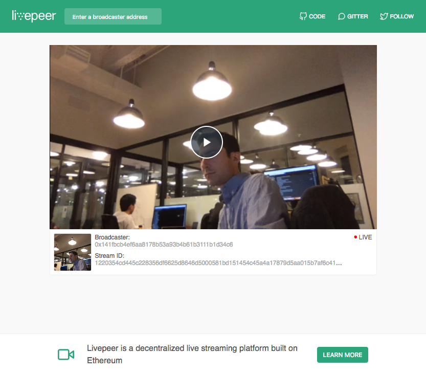

# Livepeer Video Player

A video player for the web. Lets you see what's live streaming on the network. Our hosted media player ([media.livepeer.org](https://media.livepeer.org)) runs off of this project.

More docs to come soon! For now, take a look at the `scripts` section of [`package.json`](https://github.com/livepeer/livepeerjs/blob/master/packages/player/package.json#L29)
